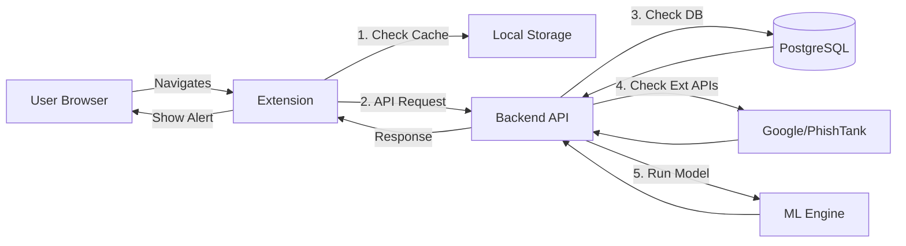

# System Design Document

## 1. Architecture Overview

The system consists of three main components:
1.  **Browser Extension (Client)**: Intercepts navigation, displays status, and communicates with the backend.
2.  **Backend API (Server)**: Handles checking URLs, aggregation of threat intelligence, and ML inference.
3.  **Database**: Stores user data, whitelists/blacklists, and scan logs.



## 2. API Endpoints

### `GET /health`
- **Purpose**: Server health check.
- **Response**: `{"status": "ok"}`

### `POST /api/scan`
- **Purpose**: Analyze a URL for phishing threats.
- **Request**:
    ```json
    {
      "url": "https://example.com/login"
    }
    ```
- **Response**:
    ```json
    {
      "url": "https://example.com/login",
      "status": "safe", // safe, suspicious, phishing
      "confidence": 0.98,
      "sources": ["google_safe_browsing", "heuristic_model"]
    }
    ```

### `POST /api/report`
- **Purpose**: Report a false positive or missed phishing site.
- **Request**:
    ```json
    {
      "url": "...",
      "type": "false_positive" // or "phishing"
    }
    ```

## 3. Data Models

### ScanResult
- `id`: UUID
- `url`: String (Indexed)
- `domain`: String (Indexed)
- `status`: Enum (SAFE, SUSPICIOUS, MALICIOUS)
- `scan_date`: Timestamp
- `source`: String (e.g., "cache", "api", "ml")

## 4. Phishing Detection Logic (Pipeline)

1.  **Allow/Block List Check**: fast lookup in local custom lists.
2.  **Threat Intelligence**: Query Google Safe Browsing / PhishTank.
3.  **Heuristics**: Check for:
    - IP address as hostname
    - Excessive subdomains
    - Typosquatting (Levenshtein distance against popular domains)
    - Suspicious TLDs
4.  **Content Analysis (Optional)**: Fetch page HTML and check for login forms on non-secure pages, etc.